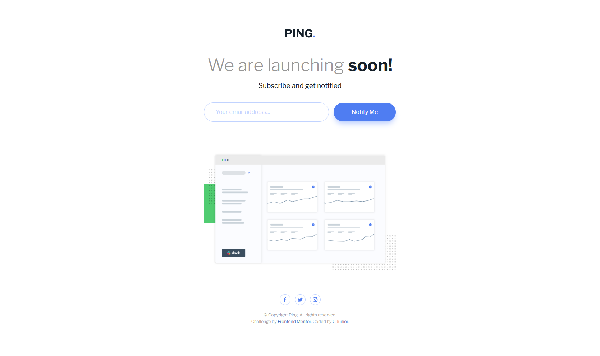
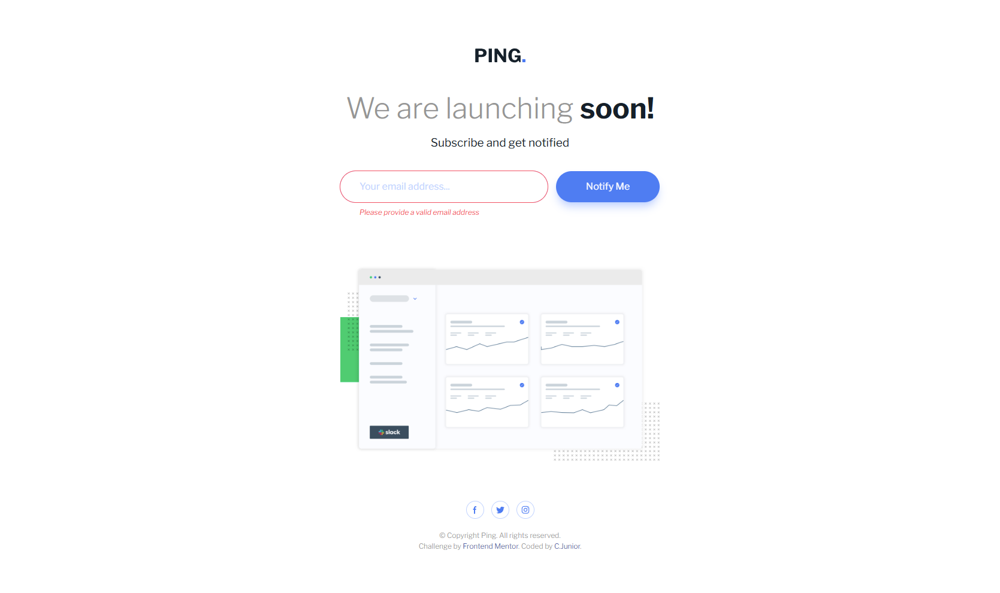
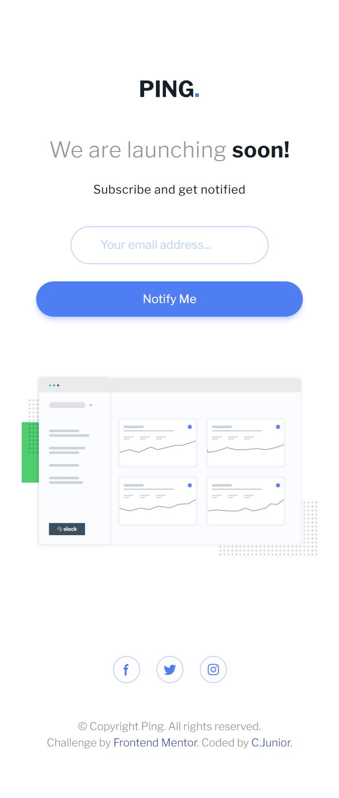
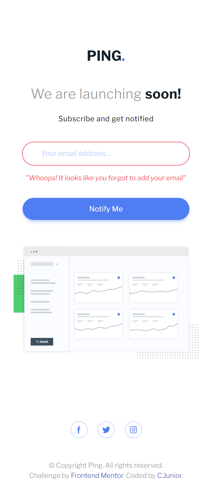

# Frontend Mentor - Ping coming soon page solution

This is a solution to the [Ping coming soon page challenge on Frontend Mentor](https://www.frontendmentor.io/challenges/ping-single-column-coming-soon-page-5cadd051fec04111f7b848da). Frontend Mentor challenges help you improve your coding skills by building realistic projects.

## Table of contents

-   [Overview](#overview)
    -   [The challenge](#the-challenge)
    -   [Screenshot](#screenshot)
    -   [Links](#links)
-   [My process](#my-process)
    -   [Built with](#built-with)
    -   [What I learned](#what-i-learned)
    -   [Continued development](#continued-development)
-   [Author](#author)

## Overview

### The challenge

Users should be able to:

-   View the optimal layout for the site depending on their device's screen size
-   See hover states for all interactive elements on the page
-   Submit their email address using an `input` field
-   Receive an error message when the `form` is submitted if:
    -   The `input` field is empty. The message for this error should say _"Whoops! It looks like you forgot to add your email"_
    -   The email address is not formatted correctly (i.e. a correct email address should have this structure: `name@host.tld`). The message for this error should say _"Please provide a valid email address"_

### Screenshot

Desktop



Mobile




### Links

-   Solution URL: [Add solution URL here](https://your-solution-url.com)
-   Live Site URL: [Add live site URL here](https://your-live-site-url.com)

## My process

### Built with

-   Semantic HTML5 markup
-   Mobile-first workflow
-   [Tailwind](https://tailwindcss.com/) - A utility-first CSS framework

### What I learned

My learnings in this project was about reinforce my knowledge about Tailwindcss, semantic HTML and Javascript.

```js
const fragment = document.createDocumentFragment();
const paragraph = document.createElement("p");
paragraph.innerText = '"Whoops! It looks like you forgot to add your email"';
paragraph.classList.add("text-light-red", "text-[12px]", "italic", "min-md:text-start", "min-md:px-8");
fragment.appendChild(paragraph);
if (emailAlert.childElementCount > 0) {
	emailAlert.innerText = "";
}
emailAlert.appendChild(fragment);
```

### Continued development

I wanna continue focusing on Tailwindcss and semantica HTML, besides the Javascritpt. Improves techniques and go deeper into applications logic.

## Author

-   Github - [CJunior](https://github.com/Clar-Junior)
-   Frontend Mentor - [@Clar-Junior](https://www.frontendmentor.io/profile/Clar-Junior)
